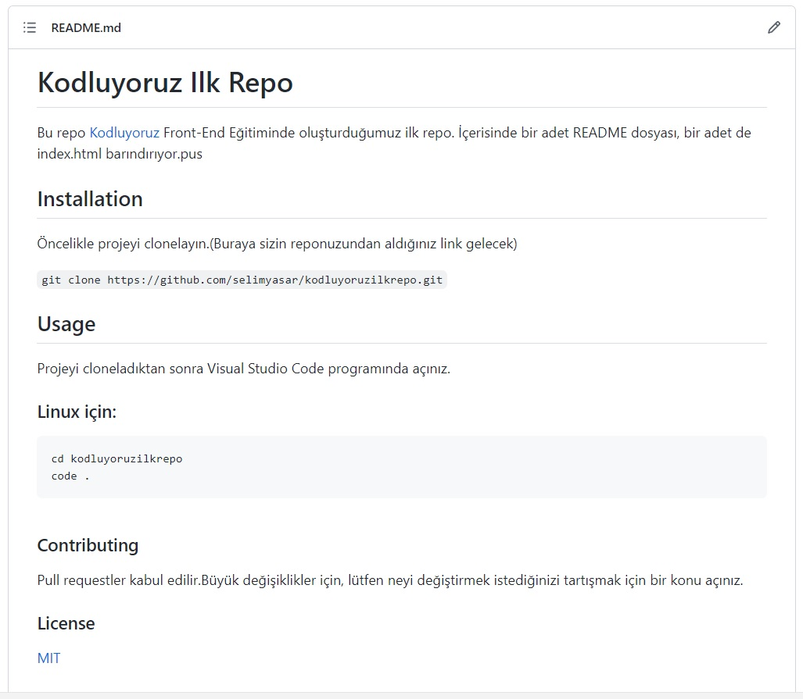

# Kodluyoruz Ilk Repo
Bu repo [Kodluyoruz](http://www.kodluyoruz.org) Front-End Eğitiminde oluşturduğumuz ilk repo. İçerisinde bir adet README dosyası, bir adet de index.html barındırıyor.


## Installation
Öncelikle projeyi clonelayın.(Buraya sizin reponuzundan aldığınız link gelecek)

```git clone https://github.com/selimyasar/kodluyoruzilkrepo.git```

## Usage
Projeyi cloneladıktan sonra Visual Studio Code programında açınız.

###  Linux için:
```linux
cd kodluyoruzilkrepo
code .
```

### Contributing
Pull requestler kabul edilir.Büyük değişiklikler için, lütfen neyi değiştirmek istediğinizi tartışmak için bir konu açınız.

### License
[MIT](https://choosealicense.com/licenses/mit/)